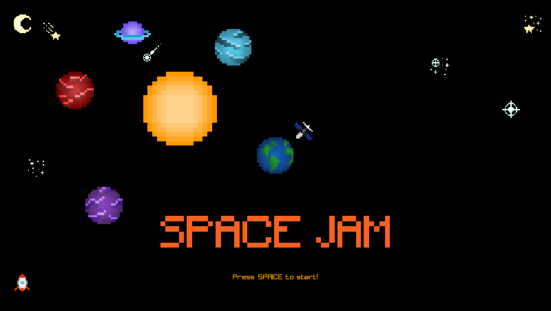

# Space Jam

    

## About
2D game written with the help of the Raylib library. Space Jam is a game made for the Hive Helsinki Game Jam that was held in May 2025.
The task was to create a game within 48 hours with a theme 'World worth saving'. We created a game in C with my classmate [Hieu](https://github.com/hieutrpham).
Shoot aliens, save the Earth, have fun.

## Installation
This game is only compiled for Linux. Run ./game. The file is compiled with a static Raylib library, so there should be no other missing dependencies.

## Credits & License
All original images created by peony. [link](https://opengameart.org/content/space-pixel-art) 
Small edits made by the authors of this repository. 
License: [CC BY 4.0](https://creativecommons.org/licenses/by/4.0/)
